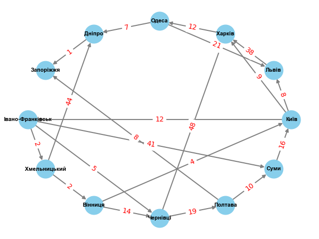
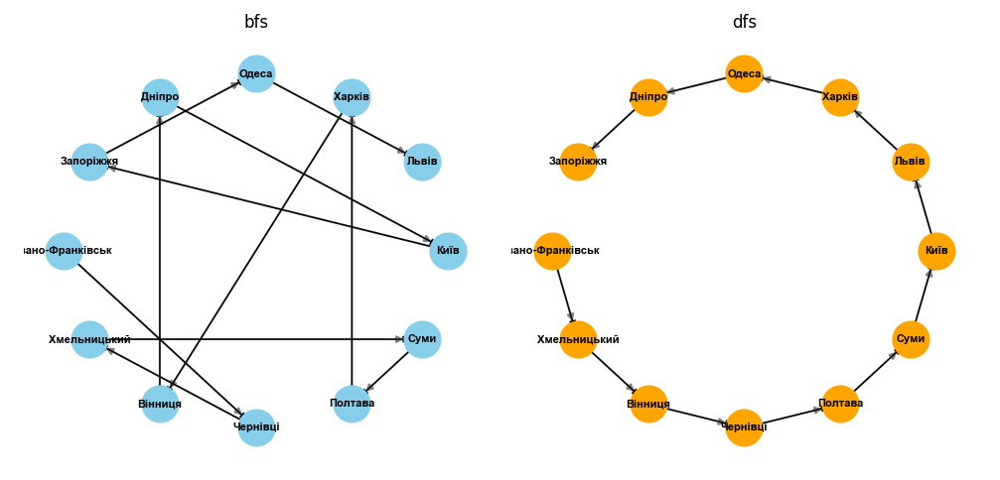
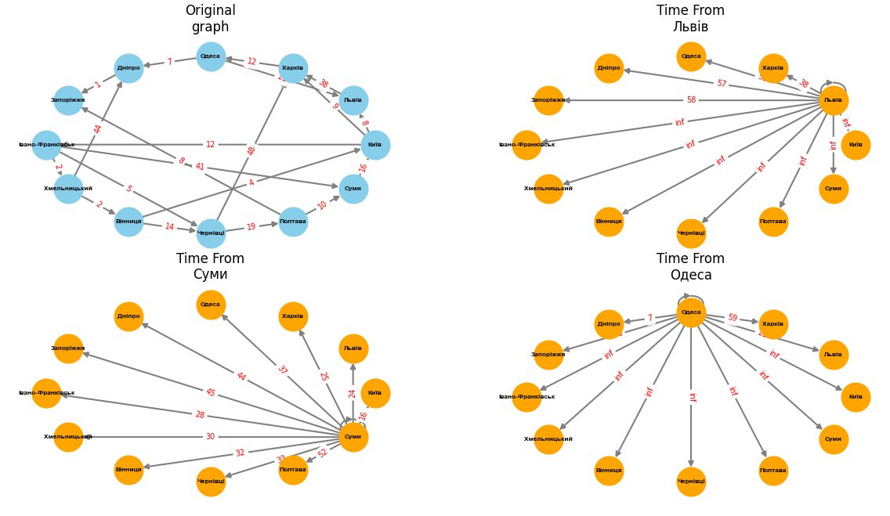

# goit-algo-hw-06

## 1. Define graph

For this task oriented graph was created. Graph is directed, weighted.

Graph shows travel time between Ukraine cities using public transport such as railway, bus. 

Graph stats:
|Graph stats||
|-|-|
|nodes|['Київ', 'Львів', 'Харків', 'Одеса', 'Дніпро', 'Запоріжжя', 'Івано-Франківськ', 'Хмельницький', 'Вінниця', 'Чернівці', 'Полтава', 'Суми']|
|edges|[('Київ', 'Львів'), ('Київ', 'Харків'), ('Київ', 'Івано-Франківськ'), ('Львів', 'Харків'), ('Харків', 'Одеса'), ('Одеса', 'Дніпро'), ('Одеса', 'Львів'), ('Дніпро', 'Запоріжжя'), ('Івано-Франківськ', 'Хмельницький'), ('Івано-Франківськ', 'Чернівці'), ('Івано-Франківськ', 'Суми'), ('Хмельницький', 'Вінниця'), ('Хмельницький', 'Дніпро'), ('Вінниця', 'Чернівці'), ('Вінниця', 'Київ'), ('Чернівці', 'Харків'), ('Чернівці', 'Полтава'), ('Полтава', 'Суми'), ('Полтава', 'Запоріжжя'), ('Суми', 'Київ')]|
|nodes count|12|
|edges count|20|
|in_degree|[('Київ', 2), ('Львів', 2), ('Харків', 3), ('Одеса', 1), ('Дніпро', 2), ('Запоріжжя', 2), ('Івано-Франківськ', 1), ('Хмельницький', 1), ('Вінниця', 1), ('Чернівці', 2), ('Полтава', 1), ('Суми', 2)]|
|out_degree|[('Київ', 3), ('Львів', 1), ('Харків', 1), ('Одеса', 2), ('Дніпро', 1), ('Запоріжжя', 0), ('Івано-Франківськ', 3), ('Хмельницький', 2), ('Вінниця', 2), ('Чернівці', 2), ('Полтава', 2), ('Суми', 1)]|
|in_edges|[('Суми', 'Київ'), ('Вінниця', 'Київ'), ('Київ', 'Львів'), ('Одеса', 'Львів'), ('Київ', 'Харків'), ('Львів', 'Харків'), ('Чернівці', 'Харків'), ('Харків', 'Одеса'), ('Одеса', 'Дніпро'), ('Хмельницький', 'Дніпро'), ('Дніпро', 'Запоріжжя'), ('Полтава', 'Запоріжжя'), ('Київ', 'Івано-Франківськ'), ('Івано-Франківськ', 'Хмельницький'), ('Хмельницький', 'Вінниця'), ('Вінниця', 'Чернівці'), ('Івано-Франківськ', 'Чернівці'), ('Чернівці', 'Полтава'), ('Полтава', 'Суми'), ('Івано-Франківськ', 'Суми')]|
|out_edges|[('Київ', 'Львів'), ('Київ', 'Харків'), ('Київ', 'Івано-Франківськ'), ('Львів', 'Харків'), ('Харків', 'Одеса'), ('Одеса', 'Дніпро'), ('Одеса', 'Львів'), ('Дніпро', 'Запоріжжя'), ('Івано-Франківськ', 'Хмельницький'), ('Івано-Франківськ', 'Чернівці'), ('Івано-Франківськ', 'Суми'), ('Хмельницький', 'Вінниця'), ('Хмельницький', 'Дніпро'), ('Вінниця', 'Чернівці'), ('Вінниця', 'Київ'), ('Чернівці', 'Харків'), ('Чернівці', 'Полтава'), ('Полтава', 'Суми'), ('Полтава', 'Запоріжжя'), ('Суми', 'Київ')]|

Graph was defined by [networkx](01/graph.py#L11) and was draw using matplotlib.

## 2. DFS & BFS comparison
For Depth-first search and Breadth-first search comparison original graph was modified - weight was removed. 

DFS and DFS algorithms from study materials were modified - it returns results instead of printing. Using this, were genetared lists of edges for each search algorithm.

According to results, DFS return longest path included all possible nodes consequently, BFS included all nodes but it returned closest neighbors first.

## 3. Dijkstra algorithm
Dijkstra algorithm function is located [here](03/dijkstra_search.py). 

Visualisation of Dijkstra algorithm search, time between cities:
